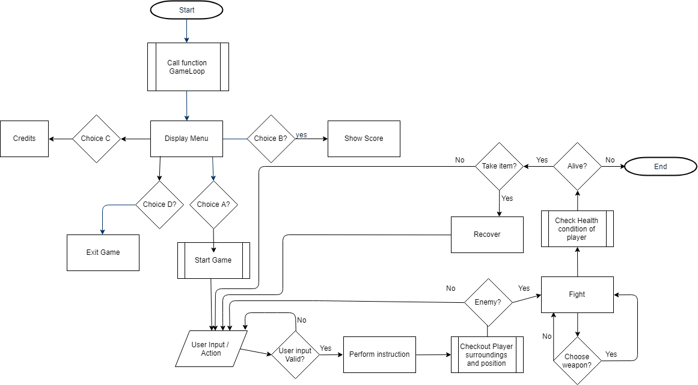

# Final lp1 project

### Authors:
**Ana dos Santos** - a21801899

**Diana Levay** - a21801515

### Repository:
link [here](https://github.com/nanilevay/projeto_lp1_segunda_epoca)

### Tasks by each group member:

**Ana dos Santos -** initial gameboard logic, code organization by creating classes and interfaces, creation of game flowchart with logic of our program, highscores logic and file creation, args conditions.

**Diana Levay -** initial gameloop logic, implementation of the menu and its options, gameboard architecture, player movement, map, traps, look around, implementation of the inventory feature and pickup, drop.

### Describing the Solution approach:
- which phases were implemented
- arquitecture of the solution, how it was organized and what data we used, algorithms implemented to - - draw the map etc.

### UML Diagram of classes created:
The following ".png" image contains the UML diagram of the classes implemented for this project.

### Fluxogram of the game loop:
The following ".png" image contains the fluxogram showcasing the game loop of the project.

### In summary / what we learned:

During the development of this project we were able to properly implement classes with inheritance, use lists and the creation of files to store and update information, implementing save features.
We attempted the use of interfaces but were able to get better results with classes, thus this was not very useful for the end goal due to our own hability contraints however it was helpful to revise some of these topics.

### References used for the development of this project:
including idea exchanges, open code reused or based on (stack overflow, github, ...) and third party libraries, very detailed

Some code from the first project we had done has been reutilised and restructured to fit this game's logic, especially when it came to setting up the board, we did not exchange ideas with any colleague this time, but we used some help from StackOverflow in order to implement the

